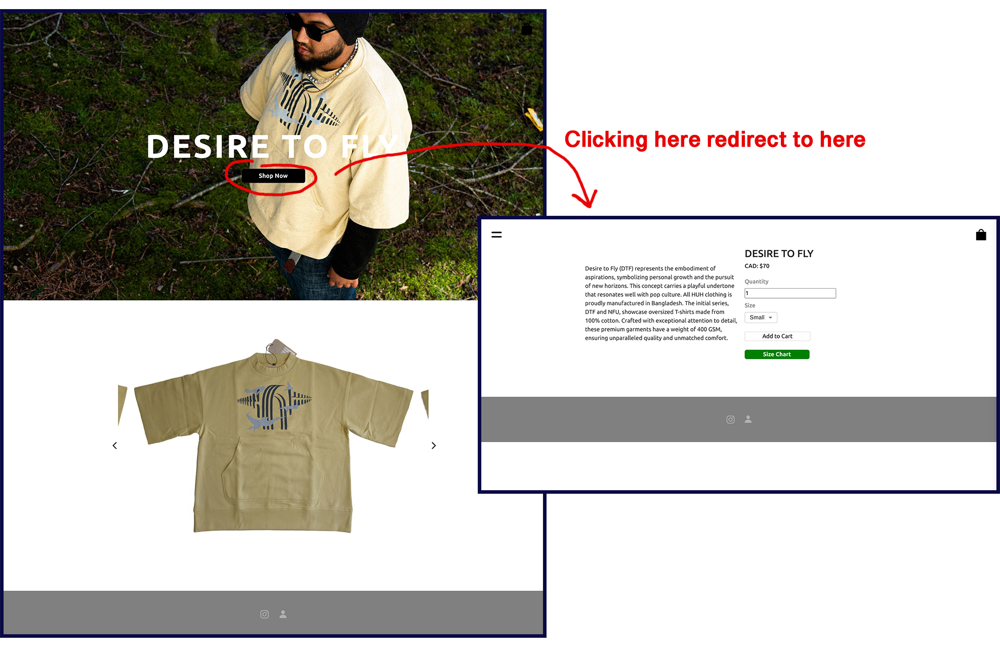
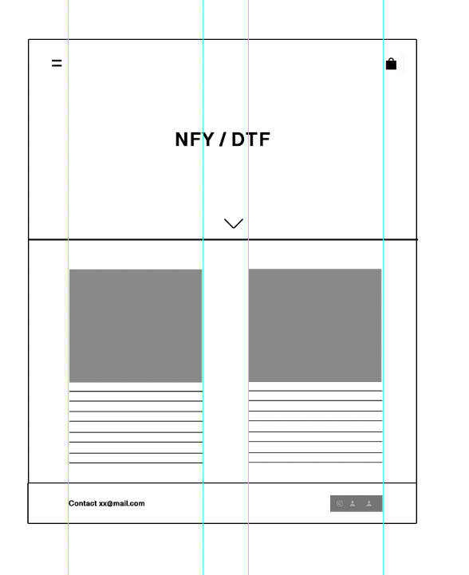
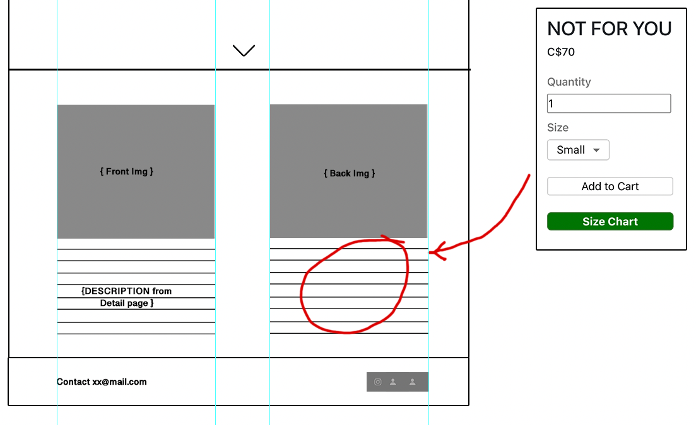

## Assignment Instructions: 
# ReactJS Application Enhancement - HUH Store

## Objective
In this assignment, you will implement design and functionality changes to an existing ReactJS application as outlined below. Diagrams are provided to help illustrate the requirements.

---

### Tasks

#### 1. Fix Loading Spinner Behavior
- Ensure the spinner spins until all contents are fully loaded.
  - **First-time load:** Should take approximately **2.4 seconds** (to show the spinner to website visitors).
  - **Subsequent loads:** Spinner time should be significantly reduced or eliminated (e.g., returning to the homepage from another page).

#### 2. Merge Detail Pages with Parent Pages
- Merge the **detail page** with its **parent page** for **DTF** and **NFY** sections.
- Refer to the provided mockup designs for guidance:
  - Existing Design:
    
  - New Layout Structure:
    
  - Merge the detail page into the parent page like so: 
    

#### 3. Dynamic Navbar
- The navbar items should dynamically change colors to ensure it is contrasting with the background.
  - For example, the nav items are dark in color, so when there's a dark background underneath, it should change to white to show contrast. Check out `.../desiretofly` to observe that the navbar items are barely visible.

#### 4. Other Requirements 
- **Existing button click functionality:**
  - Clicking on the Front/Back t-shirt images should open modal. No need for carousal.  
  - Size chart button should also work as before. 
- **Scroll Down Button:**
  - When clicked, the "Down arrow" should scroll into view to the next section at a **slow speed**.
- **Remove unwanted scrollbar:**
  - Scroll bar should not be visible on any components in the app (expect the main vertical scrollbar).
- **Clickable Contact Email:**
  - Clicking on the contact email should open the default email app.
- **Dummy Contact Links:**
  - Ensure 3 contact links are clickable (can remain as dummy links).

#### 5. Responsiveness
- Ensure the design is responsive across:
  - Mobile devices
  - Tablets
  - Desktops.

#### 6. Design Standardization
- Use relative units (e.g., %, em, rem) where possible.
- Eliminate unnecessary or uneven padding/margin.
- **Maintain the current theme and colors**, but you may improve the overall design by optionally using styling/animation libraries or standardized design principles.

#### 7. Deployment
- Deploy the project using a hosting provider of your choice (e.g., **Vercel**, **GitHub Actions**, **Netlify**, etc.).
- Submit the deployed project’s URL via the provided Google Form:
  - [Google Form Link](https://docs.google.com/forms/d/e/1FAIpQLScuVIsQOo_ZRKPBbz8kmd52NE_EeoJ-Y90dG6g-I0i_DGgqdg/viewform?usp=sharing)

#### 8. Add Error Pages
- Include a **404 page** and other appropriate error pages.

#### 9. Preserve Existing Functionality
- Ensure all existing features and functionality remain intact. For example, clicking on the image should open a modal to view the image in full.

---

### Optional (Not Required):
- Conversion to a Vite application is **not required**.
- Using TypeScript for this project is **not required** (you may do so if desired).
- Storing all information as props in the root component is **not required**. Descriptions and product details can remain hard-coded.

### Notes
- Explore the project to learn more about 
    - Redux
    - Docker files
    - Project structure
    - Package.json for loading env files.

### Submission
- Deploy the project and submit the live URL using the [Google Form](https://docs.google.com/forms/d/e/1FAIpQLScuVIsQOo_ZRKPBbz8kmd52NE_EeoJ-Y90dG6g-I0i_DGgqdg/viewform?usp=sharing).
